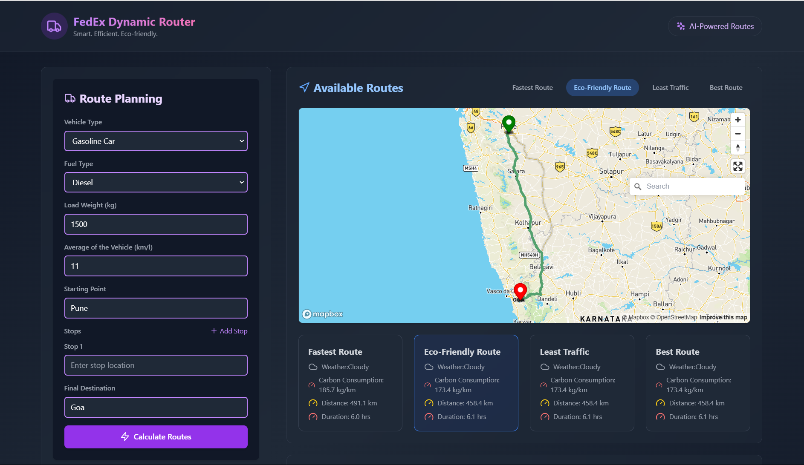
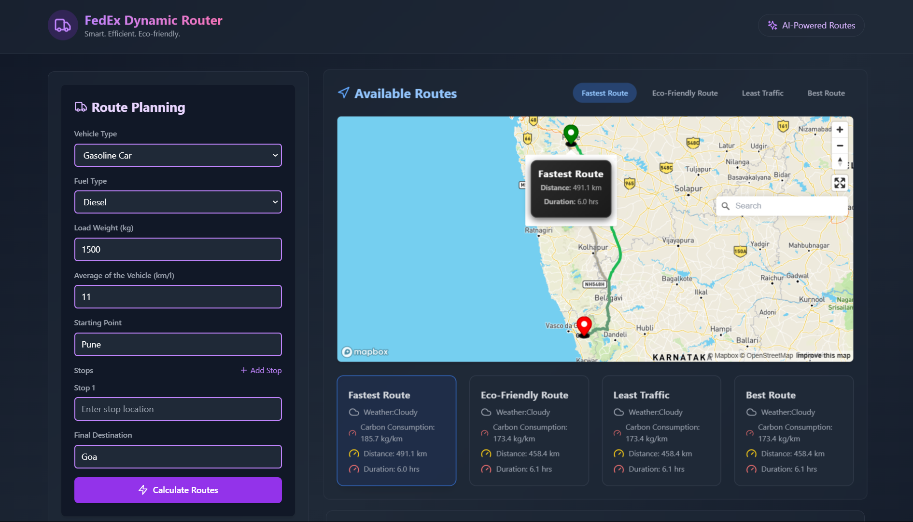
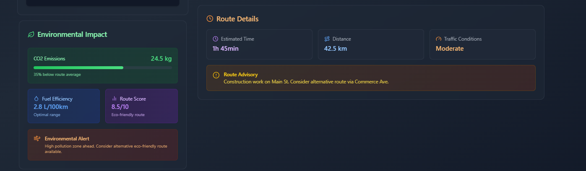

# Advanced-Dynamic-Routing-System-for-Logistics-and-Transportation

Developed an advanced dynamic routing system for logistics and transportation, optimizing routes based on real-time traffic, carbon emissions, weather, and travel time. Integrated APIs like TomTom, Google Maps, AQICN, and OSRM to reduce environmental impact while improving delivery efficiency and customer satisfaction.

## Images

